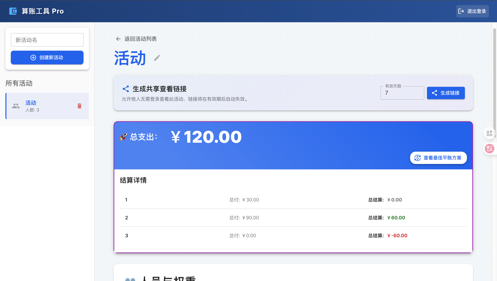
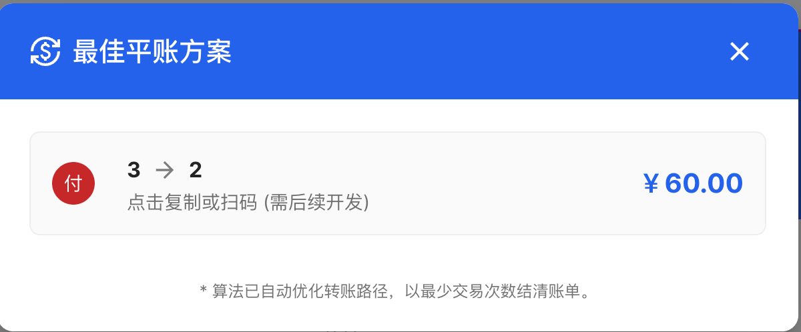
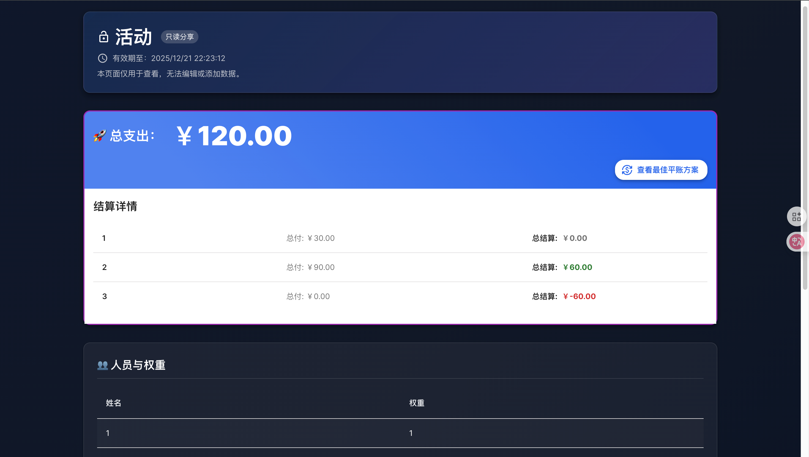
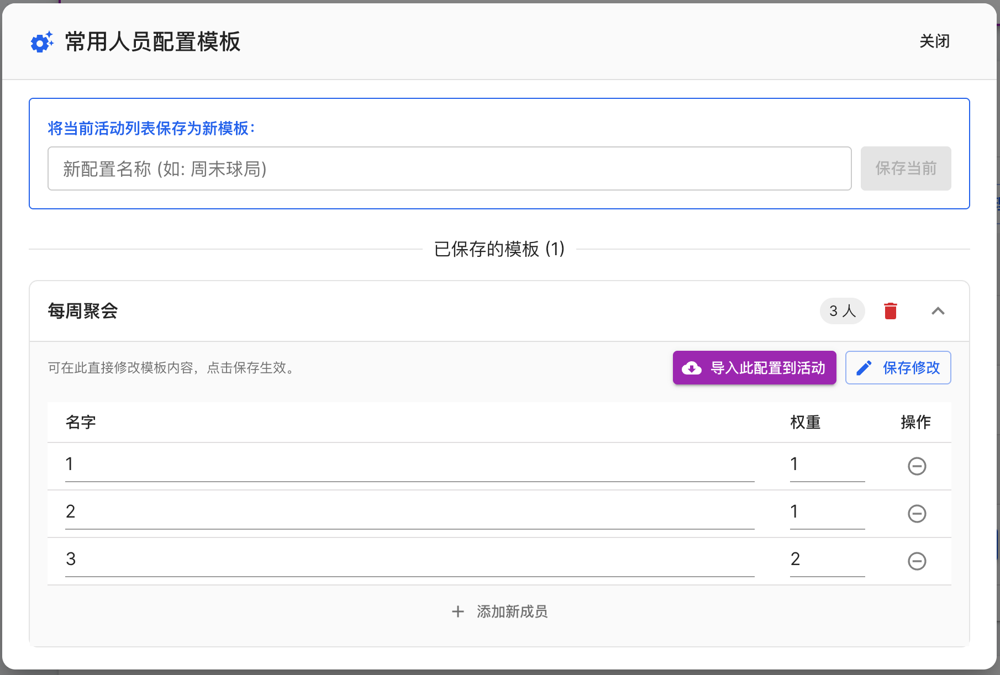
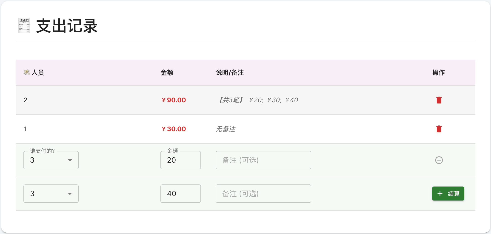
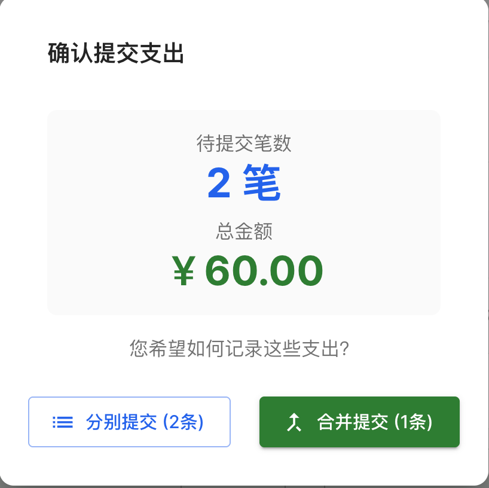
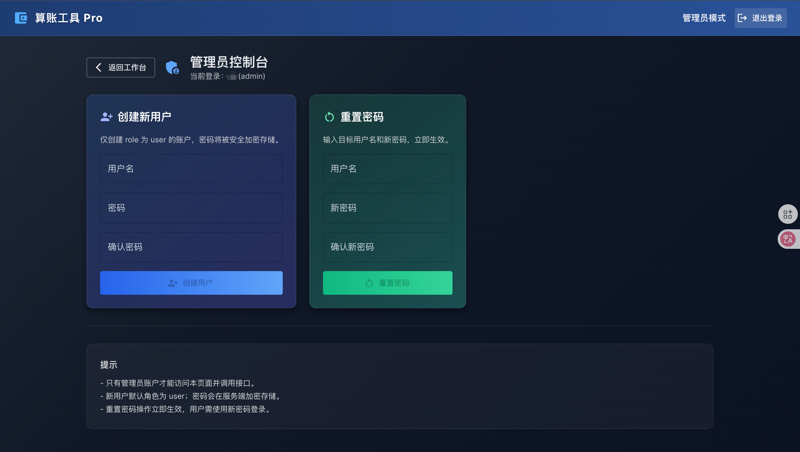

# 算账工具 Pro

> 面向多人活动的分摊记账工具：快速录入、自动结算、免登录只读分享。

## 目录
- [算账工具 Pro](#算账工具-pro)
  - [目录](#目录)
  - [项目展示](#项目展示)
  - [亮点与痛点](#亮点与痛点)
  - [快速上手](#快速上手)
  - [功能概览](#功能概览)
  - [更多文档](#更多文档)

## 项目展示
- 活动注册与平账
  
  
- 只读链接分享
  
- 人员导入/导出与常用配置
  
- 支出分别/合并提交
  
  
- 管理员管理用户
  

## 亮点与痛点
- 多人聚会/旅行/AA 账本难对齐？支持人员权重与支出记录，自动算出谁该付/谁该收。
- 不想让外部人注册？生成免登录的公开只读链接，设置有效期，分享即看。
- 安全与权限？密码哈希存储，管理员/普通用户分权，分享页只读。

## 快速上手
1. 登录（或管理员模式登录）。
2. 创建活动 → 添加人员（可设权重）→ 录入支出。
3. 查看统计与最佳平账方案。
4. 生成“免登录查看”链接并复制给他人。

## 功能概览
- 活动/人员/支出管理，支持权重分摊
- 统计与最佳平账方案
- 模板（配置）保存与导入
- 公共只读分享链接（可设有效期）
- 管理员用户管理（创建/重置密码）

## 更多文档
- 用户指南：`docs/USER.md`
- 开发者文档：`docs/DEVELOPER.md`
